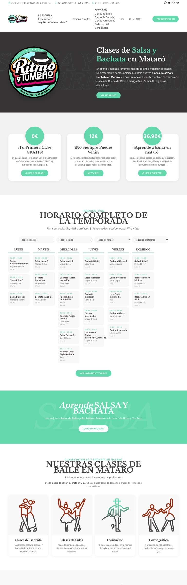
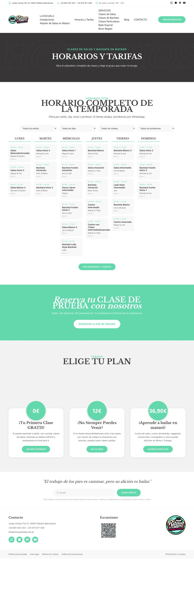
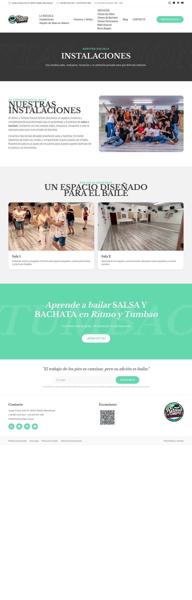
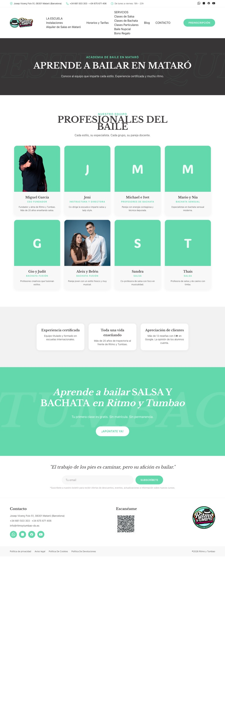
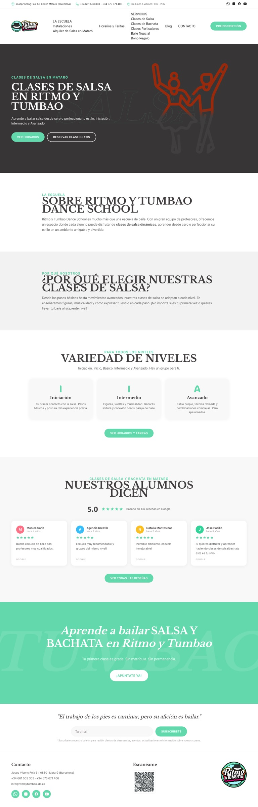
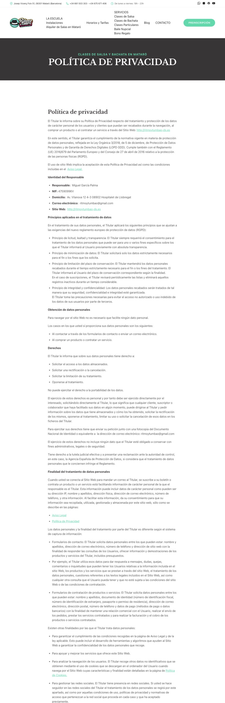

# Ritmo y Tumbao 2026 — WordPress Theme

Theme custom de WordPress para [ritmoytumbao-ds.es](https://ritmoytumbao-ds.es) — escuela de salsa y bachata en Mataró.

Sin Elementor. Sin page builders. Sin plugins extra. PHP nativo + Tailwind CSS + JS vanilla.

## Capturas

| Home | Horarios y Tarifas |
|---|---|
|  |  |

| Instalaciones | Equipo |
|---|---|
|  |  |

| Clases de Salsa | Baile Nupcial |
|---|---|
|  |  |

| Blog | Legal (Política Privacidad) |
|---|---|
|  |  |

## Stack

- **PHP** 8.1+
- **WordPress** 6.x
- **Tailwind CSS** (compilado a `assets/css/main.css`)
- Tipografías: **Libre Baskerville** (h1/h2/h3) · **ADLaM Display** (precios) · **Source Sans Pro** (body)
- Paleta principal: verde mint `#62D8AC` · tinta `#373636`

## Estructura

```
ritmoytumbao-2026/
├── style.css               — Header del theme (WP lo lee)
├── functions.php           — Bootstrap + constantes (teléfonos, dirección, URLs)
├── front-page.php          — Home (10 secciones)
├── page.php                — Páginas internas (carga template-part por slug si existe)
├── home.php                — /blog/ (listado de posts)
├── single.php              — Post individual
├── archive.php             — Categorías, etiquetas, autores
├── search.php              — Resultados de búsqueda
├── 404.php
├── header.php / footer.php
│
├── inc/
│   ├── setup.php           — after_setup_theme, nav menus
│   ├── enqueue.php         — Tailwind + 3 Google Fonts
│   ├── template-tags.php   — ryt_icon(), ryt_nav_menu(), ryt_tel_link()
│   ├── contact-form.php    — Endpoint admin-post.php?action=ryt_contact
│   └── ciudad-landing.php  — Helper ryt_render_ciudad() para landings de ciudad
│
├── template-parts/
│   ├── home/               — 10 secciones de la home
│   │   ├── hero.php
│   │   ├── pricing.php
│   │   ├── horarios.php    — Widget filtros + grid semanal (lee data/horarios.json)
│   │   ├── banner-mid.php
│   │   ├── estilos.php
│   │   ├── profesores.php
│   │   ├── instalaciones.php
│   │   ├── resenas.php
│   │   ├── cta.php
│   │   ├── faq.php         — Accordion + formulario lateral
│   │   └── blog.php
│   └── pages/              — Una página por slug WordPress
│       ├── horarios-y-tarifas.php
│       ├── instalaciones.php
│       ├── clases-de-salsa.php
│       ├── clases-de-bachata.php
│       ├── baile-nupcial.php
│       ├── clases-particulares.php
│       ├── bono-regalo-2.php
│       ├── alquiler-de-salas-en-mataro-ritmo-y-tumbao.php
│       ├── ritmo-y-tumbao-academia-de-baile-en-mataro.php
│       ├── clases-de-salsa-y-bachata-en-granollers.php
│       ├── clases-de-salsa-y-bachata-en-cabrera.php
│       └── clases-de-salsa-y-bachata-en-vilassar.php
│
├── data/
│   └── horarios.json       — 25 clases reales (estilo, nivel, día, hora, profesores, sala)
│
├── assets/
│   ├── css/main.css        — Tailwind compilado y minificado
│   └── img/                — Logos, iconos, fotos de profes, fotos de salas
│
├── src/tailwind.css        — Fuente Tailwind (base + components + utilities)
└── tailwind.config.js      — Paleta y tipografías
```

## Instalación

1. Clona este repo dentro de `wp-content/themes/`:
   ```bash
   cd wp-content/themes/
   git clone https://github.com/heydjbcn/ritmoytumbao-wp-theme.git ritmoytumbao-2026
   ```
2. Activa el theme en `Apariencia → Temas`.
3. Crea las páginas con los slugs exactos que aparecen en `template-parts/pages/` (los nombres del archivo son los slugs). El template se asignará automáticamente.
4. Asigna la home a `Inicio` y la página de posts a `Blog` desde `Ajustes → Lectura`.

## Recompilar Tailwind

```bash
./tailwindcss -c tailwind.config.js -i src/tailwind.css -o assets/css/main.css --minify
```

(El binario `tailwindcss` no está en el repo. Descárgalo de la [release oficial](https://github.com/tailwindlabs/tailwindcss/releases) si necesitas recompilar.)

## Funcionalidades

- **Widget de horarios**: 4 filtros (estilo/día/nivel/profesor) con JS vanilla sobre `data-*`. Sin AJAX. Los datos viven en `data/horarios.json`. Para que Anaïs lo edite, hay que migrar a un CPT `rt_clase` (pendiente).
- **Formulario de contacto del home**: nonce + honeypot + `wp_mail()` al email definido en `RYT_EMAIL`.
- **Landings SEO local**: helper `ryt_render_ciudad()` parametriza nombre de ciudad y distancia. Una línea de PHP por landing.
- **CTAs WhatsApp**: helper `ryt_whatsapp_url($mensaje)` para botones con texto pre-rellenado.

## Datos editables

Constantes en `functions.php`:

```php
RYT_PHONE_1, RYT_PHONE_2, RYT_PHONE_LINK
RYT_ADDRESS, RYT_OFFICE_HOURS, RYT_EMAIL
RYT_INSTAGRAM, RYT_FACEBOOK, RYT_YOUTUBE
RYT_WHATSAPP_MSG
RYT_PREINSCRIPCION_URL
RYT_APP_URL
```

## Licencia

GPLv2 (igual que WordPress core).
